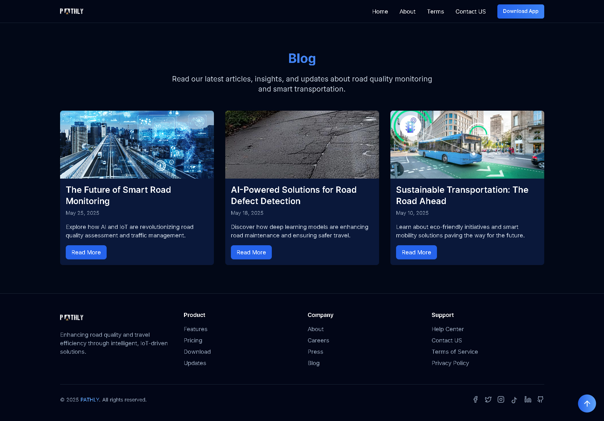
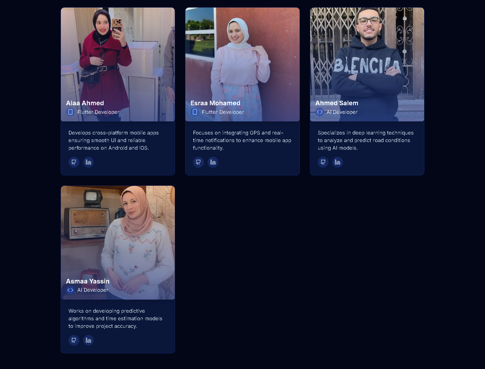

# 🚀 PATHLY – Smart Road Quality Monitoring System

---

## 🧭 About PATHLY

We are a team of 10 passionate students from the Faculty of Computer and Information Science at Mansoura University (FCIS MU), working together to revolutionize road quality monitoring through innovative IoT solutions.

### 🎯 Our Mission

At PATHLY, we're committed to making roads safer and travel more efficient through cutting-edge technology.
Our IoT-powered system detects road issues in real-time, helping authorities prioritize repairs and enabling drivers to choose safer routes.

Founded as a graduation project, PATHLY has evolved into a comprehensive solution that combines hardware sensors, mobile applications, and advanced analytics to create a complete ecosystem for road quality management.

---

## 🧠 About the Project

**Pathly** is an IoT-based web application designed to monitor road quality in real time and calculate travel time between key points. It aims to enhance road safety and help traffic authorities make better maintenance decisions. By collecting sensor data from vehicles and analyzing road conditions, Pathly empowers cities with smart, data-driven infrastructure management.

---

## 🚧 The Problem

In many areas, road quality is unknown or only evaluated manually after complaints. This causes:

- Increased accident risks
- Poor driving experience
- Inefficient road maintenance scheduling
- Lack of real-time feedback to authorities

---

## ✅ Our Solution

Pathly offers a complete end-to-end solution:

- Sensors mounted on vehicles collect real-time road condition data (vibrations, potholes, bumps).
- Data is sent to a cloud system for processing and storage.
- A web dashboard visualizes road status and travel time between points.
- Authorities can monitor road quality and prioritize repairs efficiently.

---

## 💻 Technologies Used

<ul>
  <li><strong>Frontend:</strong> Next.js, React.js, ReactRouter, TypeScript, Tailwind CSS, Shadcn/UI</li>
  <li><strong>Styling:</strong> Tailwind CSS, Responsive Design</li>
  <li><strong>UI Components:</strong> Shadcn</li>
  <li><strong>Deploying and Hosting:</strong> Vercel</li>
  <li><strong>Version Control:</strong> Git, GitHub</li>
</ul>

---

## 🛠️ Setup Instructions

Follow these steps to run the project locally:

<ul>
  <li>Install Node.js from <a href="https://nodejs.org/en" target="_blank">here</a></li>
  <li>Clone this repository</li>
  <li>Navigate to the project directory</li>
  <li>Run the following commands:</li>

<ul>
    <li><code>npm install</code></li>
    <li><code>npm run dev</code></li>
  </ul>

<li>If there's an <code>.env</code> file required, create one with the necessary API keys</li>
</ul>

---

## 🌐 Live Demo

Try the live version of Pathly here:
👉 [https://pathly-website.vercel.app/](https://pathly-website.vercel.app/)

---

## 📸 Screenshots from the Project

<picture>
  
</picture>

<picture>
  
</picture>

<picture>
  
</picture>

<picture>
  
</picture>

<picture>
  
</picture>

<picture>
  
</picture>

<picture>
  
</picture>

<picture>
  
</picture>

<picture>
  
</picture>

<picture>
  
</picture>

<picture>
  
</picture>

<picture>
  
</picture>

<picture>
  
</picture>

<picture>
  
</picture>

---

## 👥 Meet Our Team

<table>
  <tr>
    <td align="center">
       
      <strong>Esraa Gamal</strong> 
      UI - UX Designer 
      <a href="https://www.behance.net/esraagamal65">Behance</a>  |
      <a href="https://www.linkedin.com/in/esraa-gamal-89022a268">LinkedIn</a>
    </td>
    <td align="center">
       
      <strong>Ahmed Wael</strong> 
      Frontend Developer 
      <a href="https://github.com/ahmedwael29">GitHub</a> |
      <a href="https://www.linkedin.com/in/ahmedwael29/">LinkedIn</a>
    </td>
    <td align="center">
       
      <strong>Reem Badea</strong> 
      Frontend Developer 
      <a href="https://github.com/reembade3">GitHub</a> |
      <a href="#">LinkedIn</a>
    </td>
    <td align="center">
       
      <strong>Ahmed Ezzat</strong> 
      Backend Developer 
      <a href="#">GitHub</a> |
      <a href="#">LinkedIn</a>
    </td>
    <td align="center">
       
      <strong>Rewan Mahmoud</strong> 
      Backend Developer 
      <a href="https://github.com/rawanii8">GitHub</a> |
      <a href="https://www.linkedin.com/in/rawan-abuelnaga-2a2369289">LinkedIn</a>
    </td>
  </tr>
  <tr>
    <td align="center">
       
      <strong>Rana Reda</strong> 
      Backend Developer 
      <a href="https://github.com/ranareda66">GitHub</a> |
      <a href="https://www.linkedin.com/in/rana-reda-3983b3240">LinkedIn</a>
    </td>
    <td align="center">
       
      <strong>Alaa Ahmed</strong> 
      Flutter Developer 
      <a href="https://github.com/AlaaSharshera">GitHub</a> |
      <a href="https://www.linkedin.com/in/alaasharshera">LinkedIn</a>
    </td>
    <td align="center">
       
      <strong>Esraa Mohamed</strong> 
      Flutter Developer 
      <a href="https://github.com/ESRAA7751">GitHub</a> |
      <a href="https://www.linkedin.com/in/esraa-elsherbini-80785b254">LinkedIn</a>
    </td>
    <td align="center">
       
      <strong>Ahmed Salem</strong> 
      AI Developer 
      <a href="https://github.com/A7mad-Salem">GitHub</a> |
      <a href="https://www.linkedin.com/in/ahmed-salem-001967280/">LinkedIn</a>
    </td>
    <td align="center">
       
      <strong>Asmaa Yassin</strong> 
      AI Developer 
      <a href="#">GitHub</a> |
      <a href="#">LinkedIn</a>
    </td>
  </tr>
</table>

---

## 📬 Contact

For suggestions or inquiries:
📧 Email: pathly.app@gmail.com
🌐 Website: [https://pathly-website.vercel.app](https://pathly-website.vercel.app)
